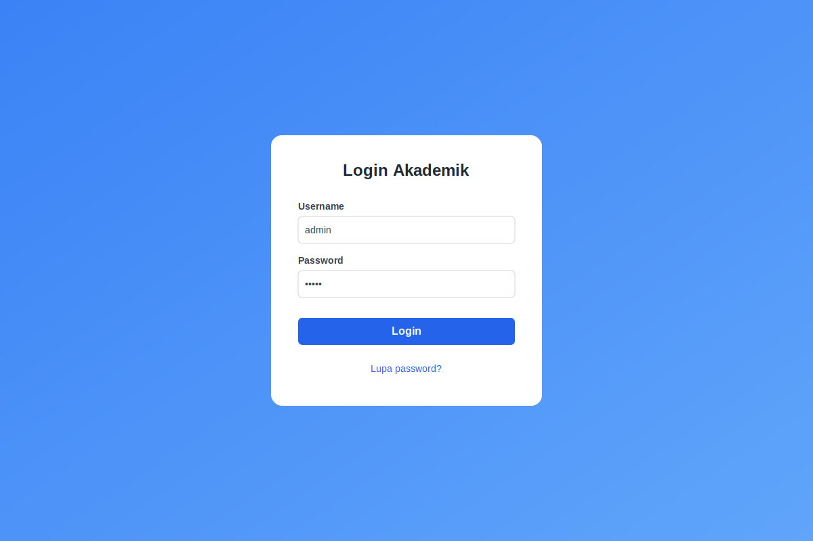
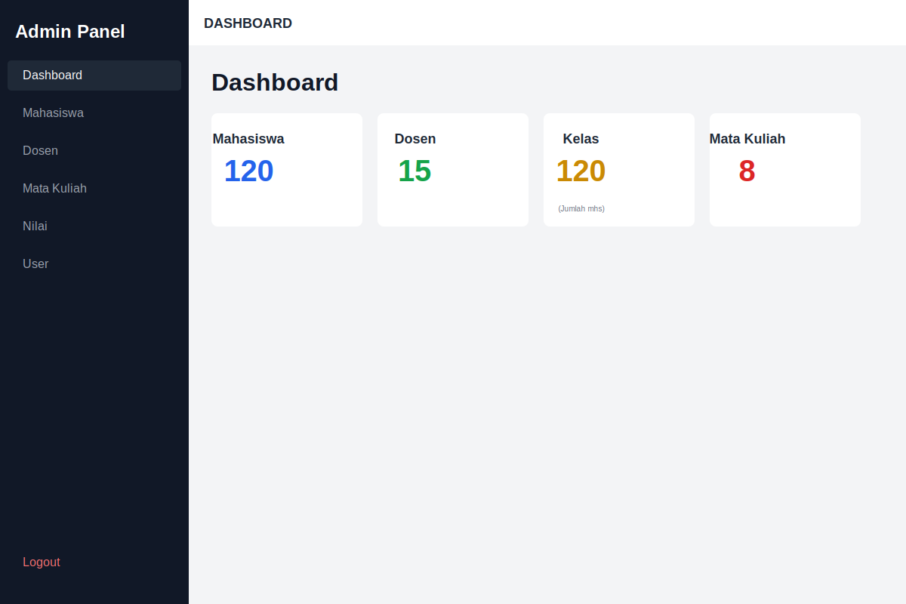
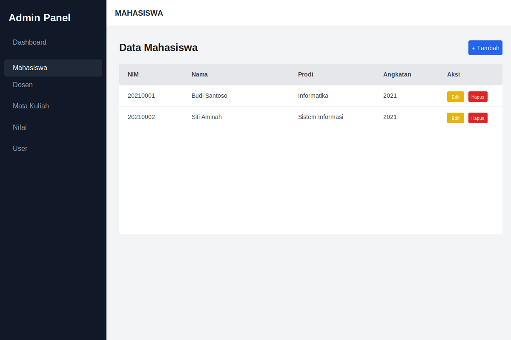
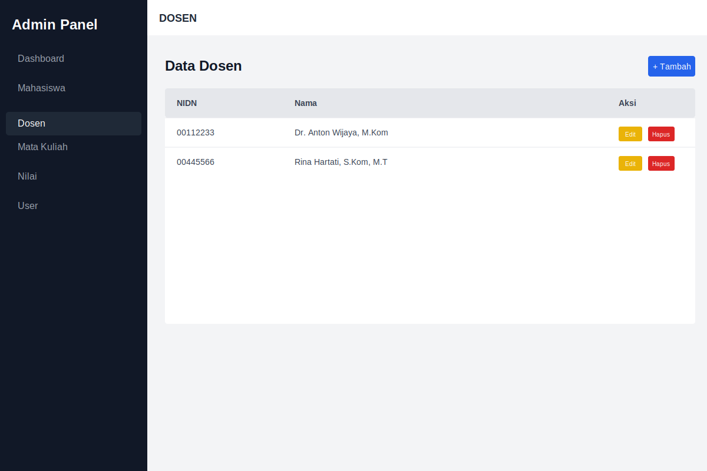
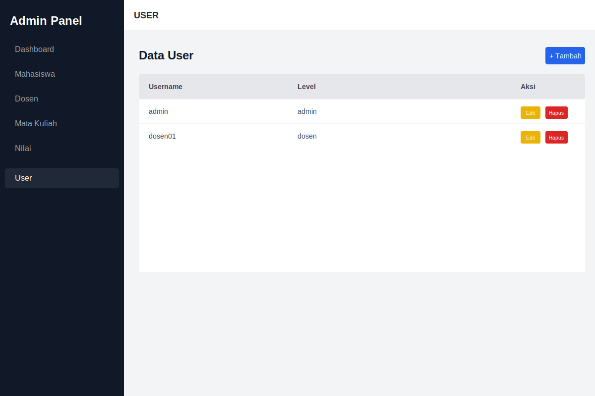

# Sistem Informasi Akademik Berbasis Web

## Deskripsi

Sistem Informasi Akademik ini dikembangkan menggunakan PHP dan MySQL untuk mendukung pengelolaan data akademik seperti mahasiswa, dosen, mata kuliah, nilai, dan pengguna sistem.

### Galeri Aplikasi

| Login | Dashboard |
|-------|-----------|
|  |  |

| Mahasiswa | Dosen |
|-----------|-------|
|  |  |

| Mata Kuliah | Nilai |
|-------------|-------|
|  |  |

| User Management | |
|-----------------|-|
|  | |

Sistem ini dirancang untuk kebutuhan pembelajaran dan simulasi akademik dengan menerapkan konsep CRUD, autentikasi berbasis session, serta dokumentasi kode menggunakan PHPDoc.

---

## Fitur Utama

* Autentikasi Login & Logout
* Reset Password (tanpa email/OTP)
* Manajemen User (Admin)
* Manajemen Mahasiswa
* Manajemen Dosen
* Manajemen Mata Kuliah
* Input & Rekap Nilai
* Role Based Access Control (Admin, Dosen, Mahasiswa)

---

## Teknologi

* PHP (Procedural)
* MySQL
* Tailwind CSS
* PHPDoc (phpDocumentor)
* Session-based Authentication

---

## Struktur Direktori

```
project/
├── auth/
├── config/
├── pages/
│   ├── admin/
│   ├── dosen/
│   └── mahasiswa/
├── index.php
```

---

## Instalasi

1. Clone / extract project
2. Import database MySQL
3. Atur koneksi di `config/connect.php`
4. Jalankan melalui web server (Apache/XAMPP)

---

## Dokumentasi & PHPDoc

### 1. Instalasi PHPDoc (via Composer)

Jika belum memiliki Composer, silakan install terlebih dahulu. Kemudian jalankan perintah berikut di terminal project:

```bash
composer require --dev phpdocumentor/phpdocumentor
```

### 2. Generate Dokumentasi

Setelah terinstal, jalankan perintah berikut untuk membuat dokumentasi HTML statis:

```bash
vendor/bin/phpdoc
```

Perintah akan otomatis membaca konfigurasi dari `phpdoc.dist.xml`.

Buka `docs/index.html` di browser untuk melihat hasilnya.

---

## Catatan Akademik

Proyek ini dikembangkan untuk memenuhi kebutuhan pembelajaran, praktikum, dan dokumentasi akademik berbasis praktik terbaik pengembangan perangkat lunak.
